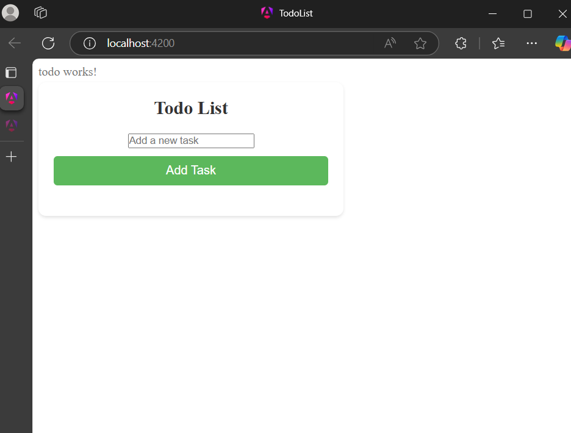
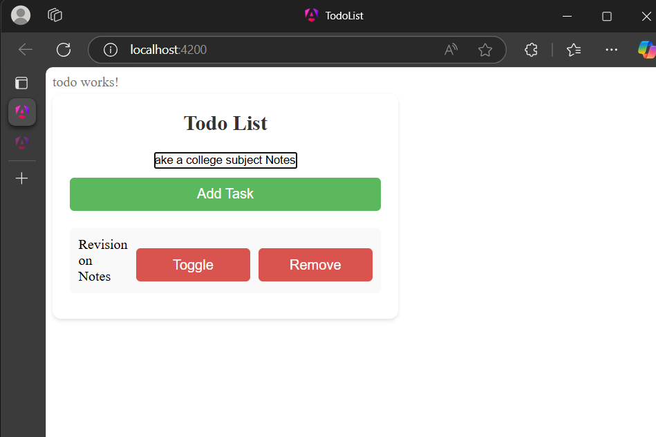
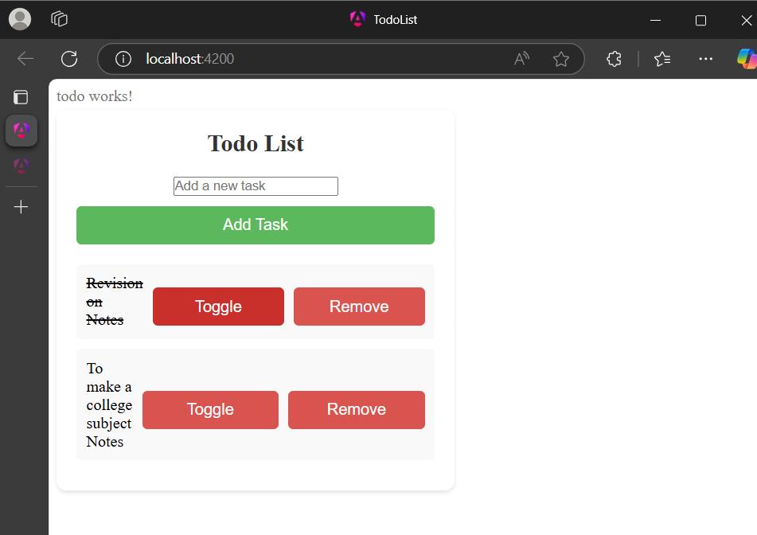

# ✅ ZenTask: Master Your Day  

**ZenTask** is a web-based **task management application** designed to help users organize their daily activities efficiently. Built using **Angular**, it provides a **simple, intuitive, and responsive interface** to add, edit, delete, and manage tasks effortlessly.  

## ✨ Features  
- 📝 **Task Management** – Add, edit, mark as complete, and delete tasks.  
- 🎨 **User-Friendly Interface** – Minimalist design for a clutter-free experience.  
- 📱 **Responsive Design** – Works seamlessly across different screen sizes.  
- ⚡ **Fast & Lightweight** – Built with Angular for smooth performance.  
- 🔄 **Auto-Save** – Tasks persist even after page refresh.  

## 🔧 Technologies Used  
- **Angular CLI 18.2.7** – Frontend framework  
- **TypeScript** – Type-safe scripting  
- **Bootstrap/Flexbox** – Responsive UI styling  

## 🚀 Development Server  
Run the following command to start the development server:  

ng serve

---

## 🖼️ Screenshots 
  
 
 
 
